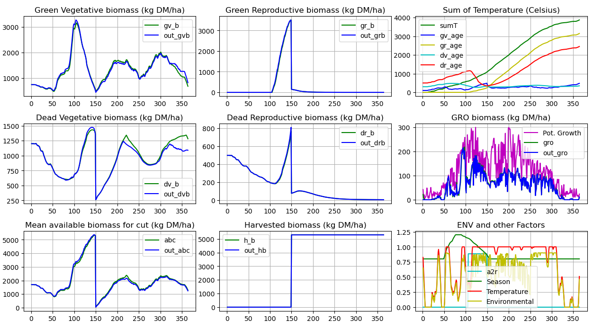
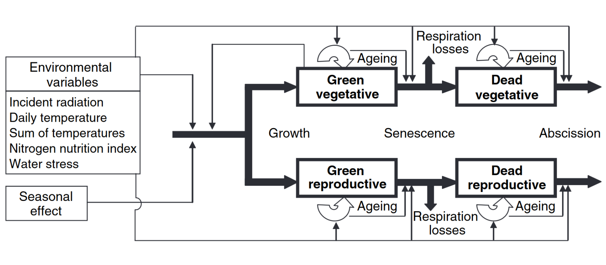

# modvege

NOTE: The newest version of this code is published as EUPL in https://code.europa.eu/agri4cast

ModVege pasture model[^1], translated from Java[^2] to Python



To investigate seasonal and annual interactions between management and grassland dynamics, a simple mechanistic model of the dynamics of production, structure and digestibility in permanent pastures was constructed. 

The model is designed to respond to various defoliation regimes, perform multiple-year simulations and produce simple outputs that are easy to use as inputs for a model of ruminant livestock production. 

Grassland communities are described using a set of average functional traits of their constituent
grass groups. 

The sward is subdivided into four structural compartments: 

```
1 - Green leaves and sheath 
2 - Dead leaves and sheath 
3 - Green stems and flowers 
4 - Dead stems and flowers 
```

Each compartment is characterized by its biomass, age and digestibility. 



Only above-ground growth is modelled, using a light-utilization efficiency approach modulated by a seasonal pattern of storage and mobilization of reserves. 

Ageing of plant parts is driven by cumulative thermal time from 1 January and by biomass flows. 

Age affects senescence, abscission and digestibility of green compartments and, therefore, the quality of green leaves and stems can increase or decrease over time in relation to net growth and defoliation dynamics. 

The functional traits having the greatest impact on model outputs are seasonal effects, period of reproductive growth and effects of temperature on photosynthetic efficiency.

The functional traits of the grass groups were parameterized for temperate pastures of the Auvergne region in France. 

The other model inputs are few:

```
1 - Proportion of functional groups
2 - Basic weather data:
    + Incident photosynthetically active radiation
    + Mean daily temperature
    + Precipitation
    + Potential evapotranspiration
3 - Site characteristics:
    + Nitrogen nutrition index
    + Soil water-holding capacity
```

In the context of a whole-farm simulator, the model can be applied at a field scale.

## Keywords
mechanistic dynamic model, permanent grassland, functional traits

## Run the model

```
> python3 ./run_modvege.py
```

[^1]: Jouven et al., 2006. Model predicting dynamics of biomass, structure and digestibility of herbage in managed permanent pastures. 1. Model description. In Grass and Forage Science, 61, 112–124.
[^2]: Kindly provided by Raphael Martin, INRAE UREP Clermont-Ferrand
